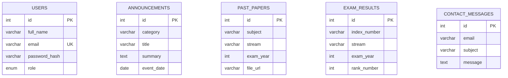

# Database Relationship Summary

```mermaid
erDiagram
  USERS {
    int id PK
    varchar full_name
    varchar email UK
    varchar password_hash
    enum role
  }

  ANNOUNCEMENTS {
    int id PK
    varchar category
    varchar title
    text summary
    date event_date
  }

  PAST_PAPERS {
    int id PK
    varchar subject
    varchar stream
    int exam_year
    varchar file_url
  }

  EXAM_RESULTS {
    int id PK
    varchar index_number
    varchar stream
    int exam_year
    int rank_number
  }

  CONTACT_MESSAGES {
    int id PK
    varchar email
    varchar subject
    text message
  }
```

The tables are intentionally simple and suitable for a beginner web-development module.
